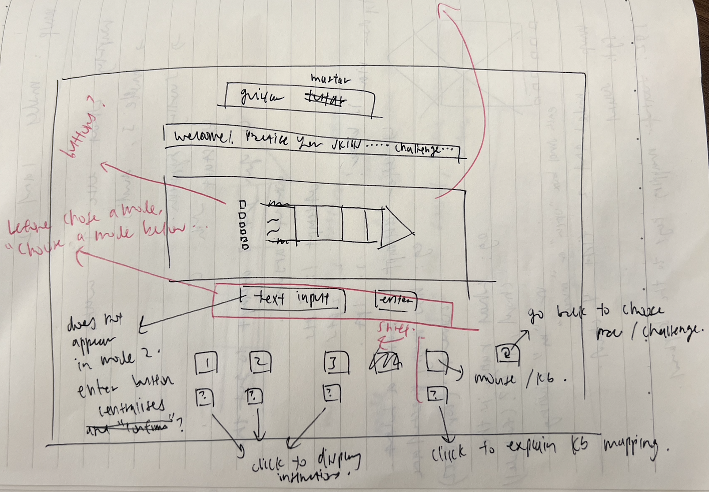
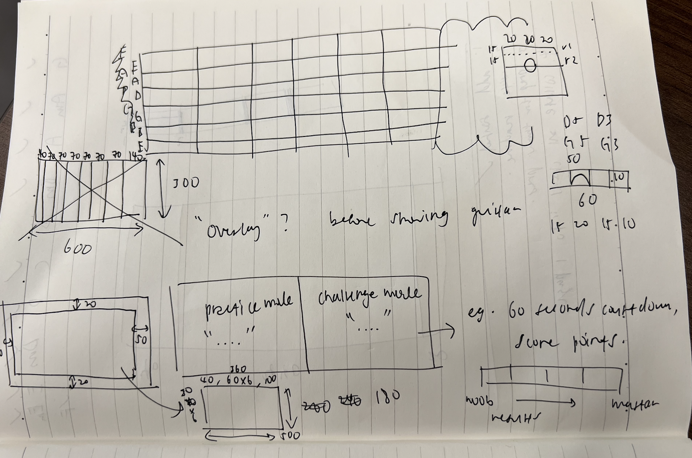

# guitar-mastar

a beginner friendly guitar game for players to strengthen their knowledge on basic chord patterns!

#

## game features

**game modes:** there are 2 modes - practice mode and challenge mode.
each mode can access 2 levels (level 1 and level 2). there are 4 ways to play this game.

**practice mode:** player gets unlimited tries to get the correct answer. question will not move on until the player gets the correct answer.

**challenge mode:** player gets 10 questions which will move on regardless of whether their answer is correct or not. there will be a score result at the end.

**level 1:** the guitar interface will display a finger pattern - the frets being pressed as well as the other strings being mute or open. from the display, users will input (via text) their answer of the chord. the input is case sensitive - "e" will not be accepted if the answer is "E".

**level 2:** the area which showed the text input in level 2 will now be a text indicating what chord the player has to identify. eg: "Identify: A". the player has to correctly indicate on the fretboard the notes being pressed as well as the state of the other strings - X or O. the area on the left of the fretboard will be initialised with "?" for all 6 strings and can be cycled through by clicking on the text itself. ? -> X -> O -> (blank).

**buttons:** there are 4 buttons at the bottom of the game. "1", "2", "sound", "home".

**1, 2:** this will bring the player to level 1 or 2, while staying in the same game mode. clicking this button in challenge mode will also reset the score and question progress.

**sound:** clicking this button will play the sound of the current chord the player has to guess. works for both levels.

**home:** this button will bring the player to the home screen - the first screen they meet upon opening up the game. they can choose practice or challenge mode from there.

#

## technologies used

this game was made with HTML, CSS, and JavaScript.

#

## general approach taken

- sketching out how the elements will be positioned (see below for sketch)
- using html and css to style out the screen
- using css to style the guitar fretboard
- working on the logic of the game
  - initialising my "library" of chords (hardcoded in)
  - practice mode level 1
  - practice mode level 2
  - creating the score keeping and question numbering
  - building the score keeping and question numbering on top of the practice mode levels 1 and 2 to make challenge mode levels 1 and 2.
  - creating the showing of results and stopping the game once question 10 is complete
  - making the buttons work (level 1, level 2, home)
  - putting in the sound and making the sound button work

#

## sketches

#

## major hurdles

one major hurdle was making the buttons (level 1, 2, home) bug-free. the issue that surfaced was during the challenge mode, when players finish all 10 questions, the input area / submit button will disappear so as to terminate the round, but since it was already removed at this point, there will be an error when i want to hide it again and bring it back again when restarting the game. the hiding again must be done since players can press the buttons at any time during the game to change modes and levels.

this was rectified by placing if else conditions in the hiding and showing input area functions. if the question is now more than 10, we hide the input area immediately and bypass the next round of hiding.

#

## unsolved problems

i intended to code the guitar fretboard from scratch using css and implementing that as the play area. i did, but the problem was that because the strings have to be above the fretboard (obviously), the horizontal area occupied by the visual strings caused that area of the fretboard to be unclickable. increasing the Z index of the fretboard area did not help because the display of the fretboard lines will be above the strings, which is visually incorrect for a guitar.

the theoretical method to fix this problem would be to create another div as an overlay, with no visual styles so it is "invisible" and does not affect the display of the guitar. the overlay would contain the fret areas which are clicked during the game. however, i failed to implement this as i could not make another overlay without causing all my html elements to shift. additionally, time was not on my side and i had spent too much time designing the guitar fretboard using CSS. hence, i decided to screen capture the guitar fretboard i had coded and use it as a background. if i have nothing to do in the future (highly unlikely), i would like to revisit this overlay strategy and not "cheat" by using an image as the background.

#

this is the end of my readme. thanks for reading :)
